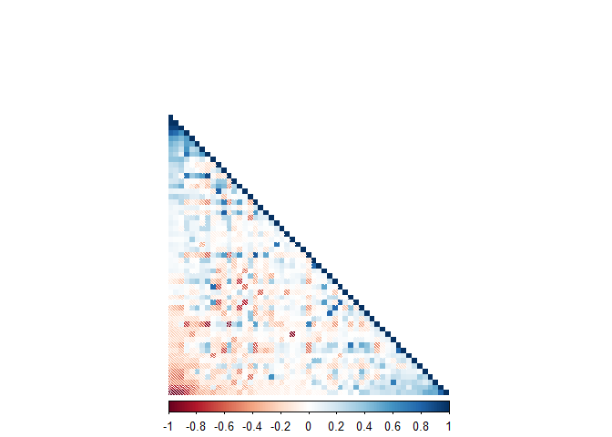
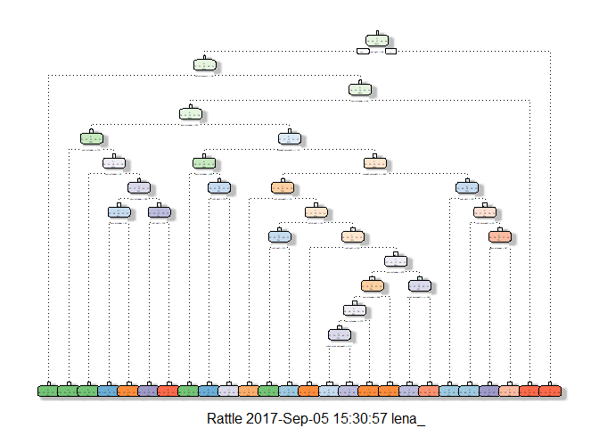

### 1. Summary

This document is to address the final project for practical machine
learning course, through coursera. The objective here is to use machine
learning tools to predict the manner in which 6 participants performed
exercise. This is equivalent to the “classe” variable in the training
set. 20 test cases provided in the test dataset is used to evaluate the
outcome of our machine learning models for the final quiz. The best
model we have obtained here is by using Random Forest method.

### 2. Data Analysis

#### Data Creation

First step is to load the packages which will be used in this project,
in addition to setting our working directory, and downloading provided
datasets:

Here we have divided our dataset to training and test data set. This
dataset includes 160 variables.

#### Data Cleanup

First, the training data set is explored for missing values.

    NAValues = sapply(TrainingSet, function(x) sum(is.na(x)))
    threshold = as.integer(names(table(NAValues))[2])
    table(NAValues)

    ## NAValues
    ##     0 13443 
    ##    93    67

    VarNo1 = NCOL(TrainingSet)
    TrainingSet = TrainingSet[,NAValues<threshold]
    TestSet = TestSet[,NAValues<threshold]

Out of 13737 observations of 160 variables in our Training Set, some
variables have 13443 missing values. This is more than 97.86 % for these
variables. Hence, we will ignore these variables as we basically do not
have enough information about them. This leaves us with 93 variables for
training. The same is applied to the test set.

Next we will check for variables which don't have enough variability
(They are fixed), and remove them. For this simply the variance of the
remaining variables is checked:

    Var <- nearZeroVar(TrainingSet)
    TrainingSet <- TrainingSet[-Var]
    TestSet  <- TestSet[-Var]
    TrainingSet <- TrainingSet[6:59]
    TestSet  <- TestSet[6:59]

The first 5 variables are for identification purposes only, so they will
be removed as well. This leaves us with 54 variables for training.

#### Data Analysis

As the first step, we will look at the correlation between the remaining
variables is oberved:

    CorMatrix <- cor(TrainingSet[, -54])
    corrplot(CorMatrix, order = "FPC", method = "shade", type = "lower", 
             tl.cex = 0.8, tl.col = rgb(1, 1, 1))

Here, darker colors are indicators of higher correlations. As it can be
seen, not too many variables are highly correlated here.

#### Model Prediction

Random Forests, and Decision Tree will be applied for model prediction,
and their accuracy will be compared on the test subset we have created.
The best obtained model will be used for final quiz evaluation.

##### Random Forests

    RFControl <- trainControl(method="cv", number=3, verboseIter=FALSE)
    RFModel <- train(classe ~ ., data=TrainingSet, method="rf",
                              trControl=RFControl)
    RFModel$finalModel

    ## 
    ## Call:
    ##  randomForest(x = x, y = y, mtry = param$mtry) 
    ##                Type of random forest: classification
    ##                      Number of trees: 500
    ## No. of variables tried at each split: 27
    ## 
    ##         OOB estimate of  error rate: 0.17%
    ## Confusion matrix:
    ##      A    B    C    D    E  class.error
    ## A 3905    1    0    0    0 0.0002560164
    ## B    3 2653    2    0    0 0.0018811136
    ## C    0    4 2391    1    0 0.0020868114
    ## D    0    0    7 2244    1 0.0035523979
    ## E    0    0    0    4 2521 0.0015841584

    RFPredict <- predict(RFModel, newdata=TestSet)
    RFMatrix <- confusionMatrix(RFPredict, TestSet$classe)
    RFMatrix

    ## Confusion Matrix and Statistics
    ## 
    ##           Reference
    ## Prediction    A    B    C    D    E
    ##          A 1673    2    0    0    0
    ##          B    0 1137    1    0    0
    ##          C    0    0 1025    1    0
    ##          D    0    0    0  963    0
    ##          E    1    0    0    0 1082
    ## 
    ## Overall Statistics
    ##                                          
    ##                Accuracy : 0.9992         
    ##                  95% CI : (0.998, 0.9997)
    ##     No Information Rate : 0.2845         
    ##     P-Value [Acc > NIR] : < 2.2e-16      
    ##                                          
    ##                   Kappa : 0.9989         
    ##  Mcnemar's Test P-Value : NA             
    ## 
    ## Statistics by Class:
    ## 
    ##                      Class: A Class: B Class: C Class: D Class: E
    ## Sensitivity            0.9994   0.9982   0.9990   0.9990   1.0000
    ## Specificity            0.9995   0.9998   0.9998   1.0000   0.9998
    ## Pos Pred Value         0.9988   0.9991   0.9990   1.0000   0.9991
    ## Neg Pred Value         0.9998   0.9996   0.9998   0.9998   1.0000
    ## Prevalence             0.2845   0.1935   0.1743   0.1638   0.1839
    ## Detection Rate         0.2843   0.1932   0.1742   0.1636   0.1839
    ## Detection Prevalence   0.2846   0.1934   0.1743   0.1636   0.1840
    ## Balanced Accuracy      0.9995   0.9990   0.9994   0.9995   0.9999

Random forest accuracy is 0.9992.

##### Decision Tree

    DTModel <- rpart(classe ~ ., data=TrainingSet, method="class")
    fancyRpartPlot(DTModel)

    DTPredict <- predict(DTModel, newdata=TestSet, type="class")
    DTMatrix <- confusionMatrix(DTPredict, TestSet$classe)
    DTMatrix

    ## Confusion Matrix and Statistics
    ## 
    ##           Reference
    ## Prediction    A    B    C    D    E
    ##          A 1457   91    2   17    6
    ##          B   99  887   63   37   62
    ##          C    0   55  839   41    3
    ##          D   90   81  102  733   70
    ##          E   28   25   20  136  941
    ## 
    ## Overall Statistics
    ##                                           
    ##                Accuracy : 0.8253          
    ##                  95% CI : (0.8154, 0.8349)
    ##     No Information Rate : 0.2845          
    ##     P-Value [Acc > NIR] : < 2.2e-16       
    ##                                           
    ##                   Kappa : 0.7796          
    ##  Mcnemar's Test P-Value : < 2.2e-16       
    ## 
    ## Statistics by Class:
    ## 
    ##                      Class: A Class: B Class: C Class: D Class: E
    ## Sensitivity            0.8704   0.7788   0.8177   0.7604   0.8697
    ## Specificity            0.9725   0.9450   0.9796   0.9303   0.9565
    ## Pos Pred Value         0.9263   0.7726   0.8945   0.6812   0.8183
    ## Neg Pred Value         0.9497   0.9468   0.9622   0.9520   0.9702
    ## Prevalence             0.2845   0.1935   0.1743   0.1638   0.1839
    ## Detection Rate         0.2476   0.1507   0.1426   0.1246   0.1599
    ## Detection Prevalence   0.2673   0.1951   0.1594   0.1828   0.1954
    ## Balanced Accuracy      0.9214   0.8619   0.8987   0.8453   0.9131

Decision Tree accuracy is 0.8253.

#### Best model selection

Comparing the accuracy of the two models obtained, we conclude that
Random Forest model is a better model for prediction. We use this model
to predict the answers for the final quiz.

    FinalPredict <- predict(RFModel, newdata=testing)
    FinalPredict

    ##  [1] B A B A A E D B A A B C B A E E A B B B
    ## Levels: A B C D E
